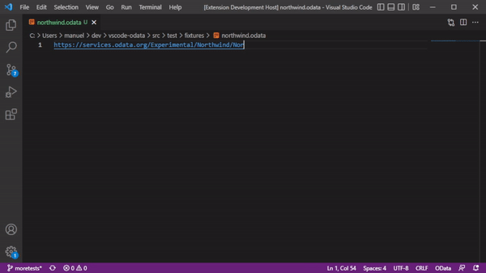

# OData for Visual Studio Code
OData for Visual Studio Code is an extension for [Visual Studio Code](https://code.visualstudio.com) that adds rich language support for the [OData](http://www.odata.org) query language.

> This is a fork from [/StanislawSwierc/vscode-odata](https://github.com/StanislawSwierc/vscode-odata), which appears to be discontinued. The fork fixes some issues and adds features. All the heavy lifting has been done by the original authors. \
[Manuel Seeger (@manuelseeger)](https://github.com/manuelseeger)

## Features
In the first release this extension adds the capabilities listed below. Only stable capabilities are enabled by default, while others can be turned on in the settings.

* syntax highlighting (enabled)
* query encoding/decoding (enabled)
* syntax-aware formatting (disabled)
* metadata-driven code completion (enabled*)
* diagnostics (disabled)

(*) Code completion is turned on by default. Metadata-driven code completion is active if a metadata file is registered in settings. 

## Metadata Awareness
The extension provides basic IntelliSense for the OData query language based on service metadata. 
### Metadata driven code completion
Provide basic Intellisense based on OData metadata: 


### Metadata driven code navigation
Navigate to metadata definitions from entities and properties: 


## Commands

#### OData Open
Combines multi-line query into a one-line URL and opens it in a browser.

#### OData Combine
Combines multi-line query into a one-line URL.


#### OData Encode URI
Encodes URI and replaces unsafe ASCII characters with a "%" followed by two hexadecimal digits. 


#### OData Decode URI
Decodes URI. This command is really helpful when you copy query from a browser or log files that store all URIs in the encoded form.


## Settings

### Quick example settings

Below is an example of a [settings.json](https://code.visualstudio.com/Docs/customization/userandworkspace) file for VSCode settings applicable to this extension. Continue to the next section for more in-depth documentation. This example enables `completion` feature and specifies where to find the metadata for queries which target `https://stansw.analytics.visualstudio.com/vscode-odata/_odata` endpoint.

```json
{    
    "odata.diagnostic.enable": false,

    "odata.format.enable": true,
    "odata.format.syntax": false,
    "odata.format.decode": true,
    
    "odata.metadata.map": [
        { 
            "url": "https://stansw.analytics.visualstudio.com/vscode-odata/_odata", 
            "path": "C:/Sources/vscode-odata/test/fixtures/metadata.xml"
        }
    ]
}
```

### Settings details
This extension can be controlled with the following settings. Please notice that currently all of them require a restart of the editor.

#### `odata.diagnostic.enable` (requires restart)
Enable/disable default diagnostics.

#### `odata.format.enable` (requires restart)
Enable/disable formatter (`Alt+Shift+F`).

#### `odata.format.decode` (requires restart)
Enable/disable URI decoding as part of formatting. This can be helpful if you copy encoded URL(s) from browser or log files. 

### `odata.format.syntax` (requires restart)
Enable/disable syntax-aware formatting.

#### `odata.metadata.map` (requires restart)
Associate metadata files in the current project. This setting consists of a list of mapping definition where user can specify url and the path to the offline metadata. Path can be full or relative to the workspace root. You can get this file by opening up `$metadata` endpoint and saving it locally. Example below was created by downloading `https://stansw.analytics.visualstudio.com/vscode-odata/_odata/$metadata` file.

 ```json
{
    "odata.metadata.map": [
        { 
            "url": "https://stansw.analytics.visualstudio.com/vscode-odata/_odata", 
            "path": "C:/Sources/vscode-odata/test/fixtures/metadata.xml"
        },
        { 
            "url": "https://stansw.analytics.visualstudio.com/proj/_odata", 
            "path": "metadata.xml"
        }
    ]
}
```

If you set the `odata.metadata.map` setting then editor will suggest names of the properties and entities. The completions are context-aware to an extend. Properties are suggested only for entitysets in the document. 

Once mapping is defined, extension will try to find the right metadata by looking for the first url that matches the beginning of the query. For the example query below extension would use metadata file at `C:/Sources/vscode-odata/test/fixtures/metadata.xml` because its mapping url `https://stansw.analytics.visualstudio.com/vscode-odata/_odata` matches the beginning of the query.
```
https://stansw.analytics.visualstudio.com/vscode-odata/_odata/WorkItems?$select...
```

## Acknowledgement
This extension was created as part of a team-wide hackathon that took place on 2017-02-28. Thank You! to the following folks that helped to make it come true.

* [Geoff Cox (@GeoffCox)](https://github.com/GeoffCox) - created initial syntax highlighting definition.
* [Konstantin Kosinsky (@Kosinsky)](https://github.com/Kosinsky) - implemented metadata parser.
